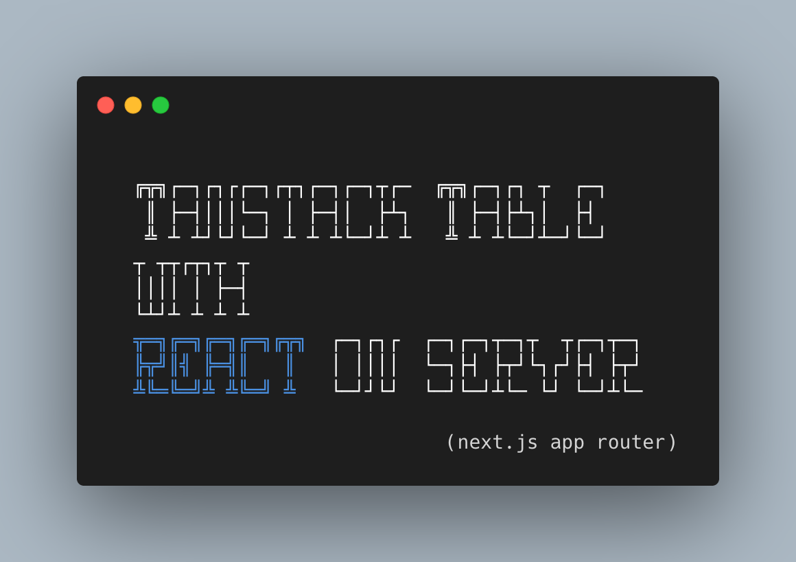
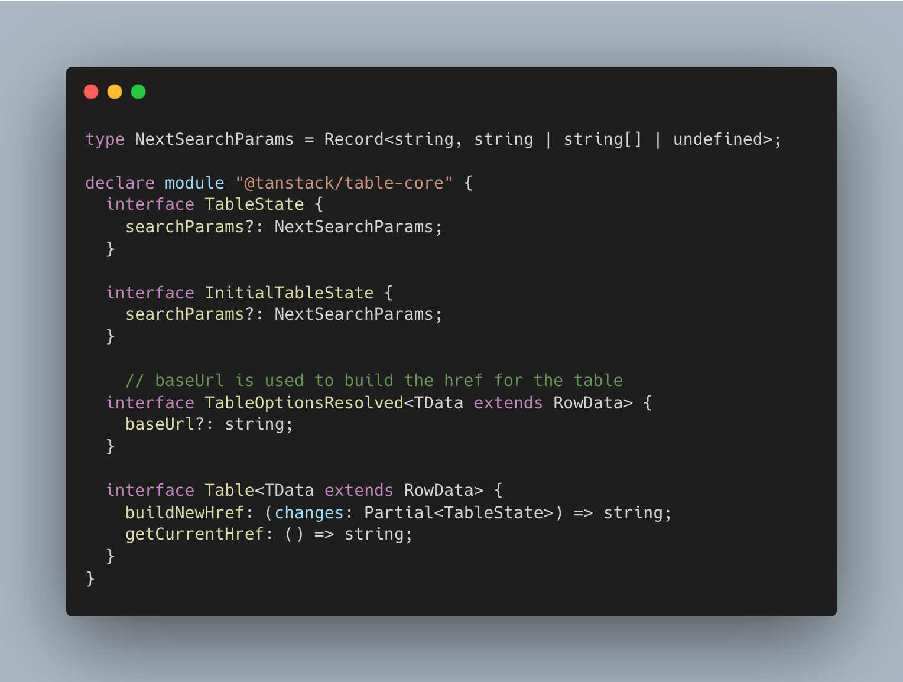
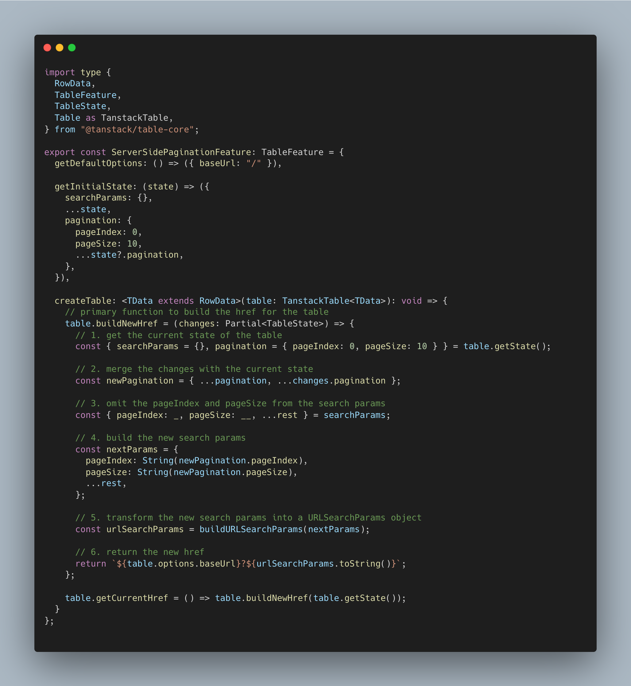
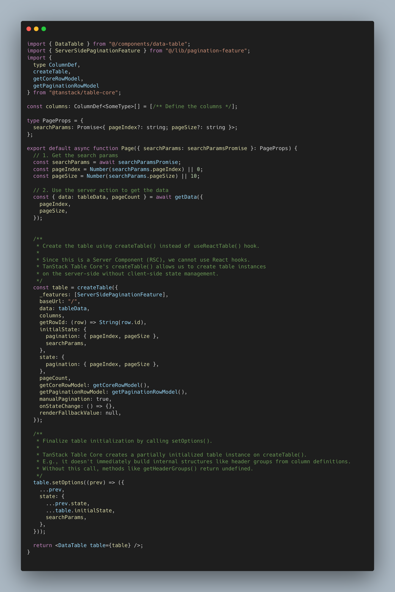
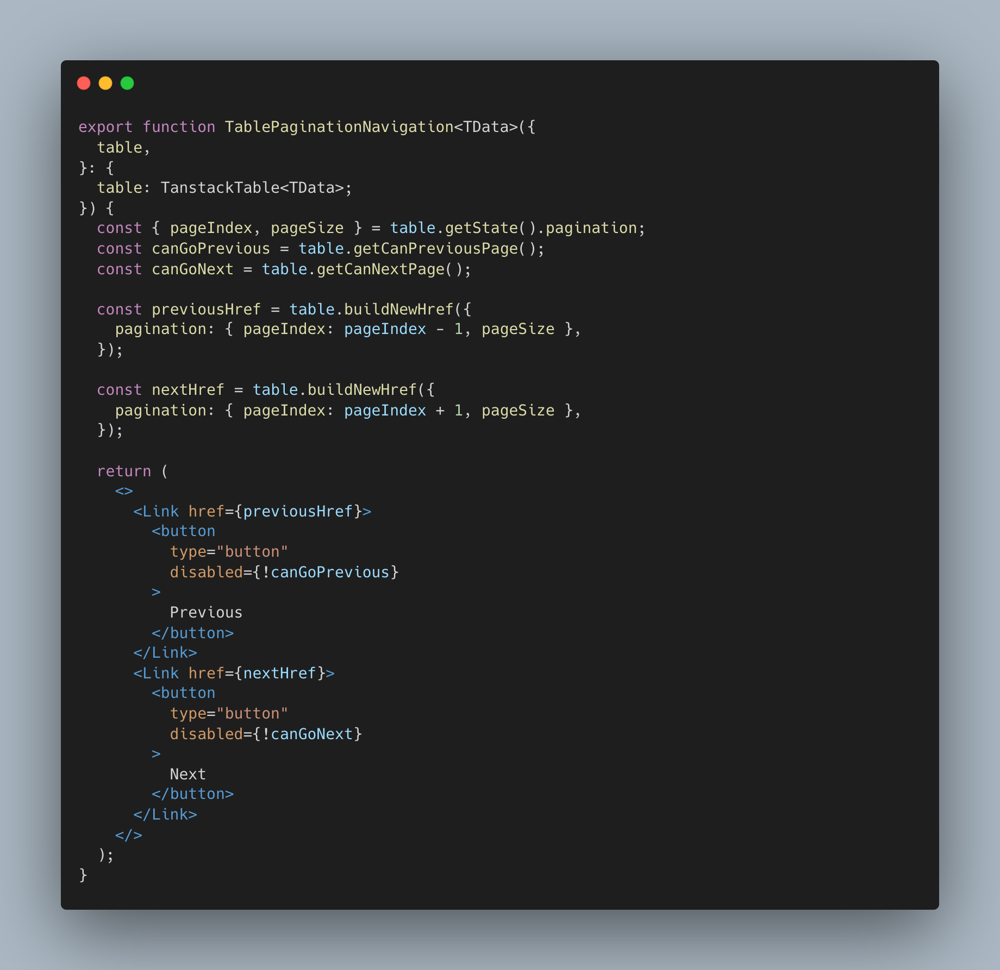
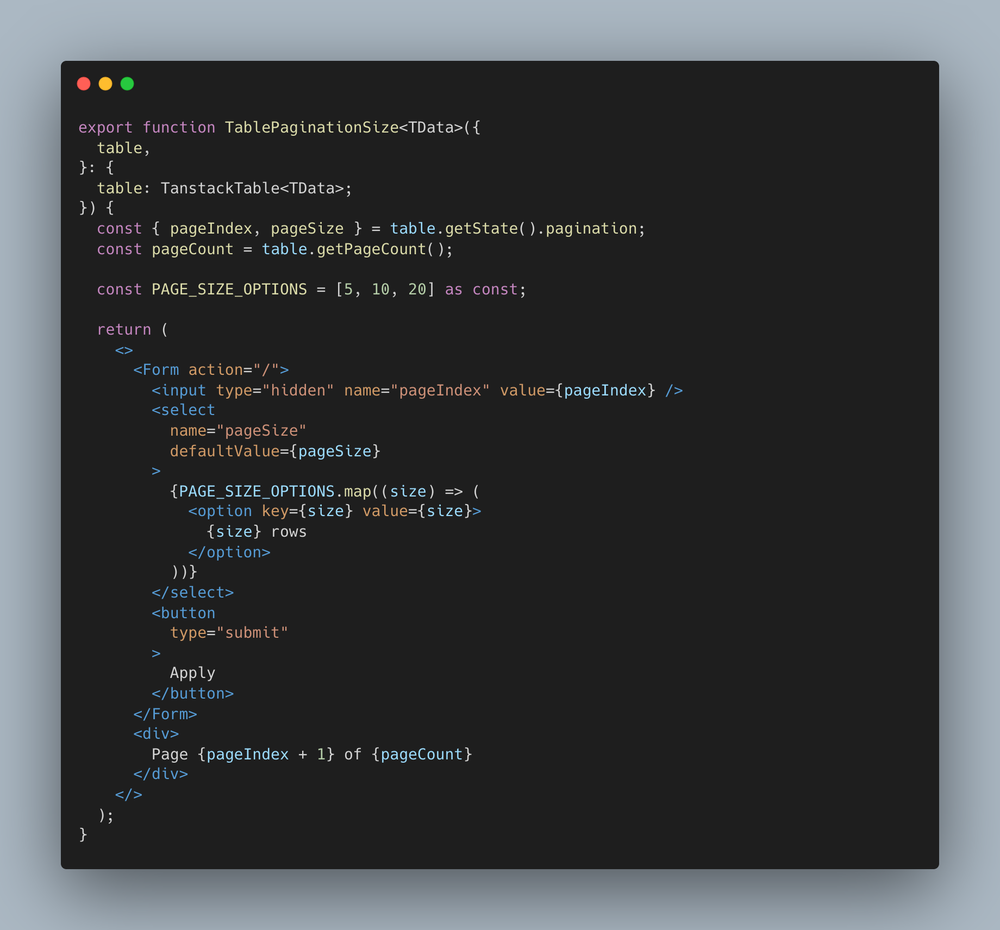

# Tanstack Table on the server

You can use Tanstack Table on the server too. No client components, just server-side React components in the Next.js App Router.

Here's how to do it:

# 2/8 
The main idea: use plain JavaScript `@tanstack/table-core`, not the hook-heavy `@tanstack/react-table`.

(`table-core` is the framework-agnostic core library—works with any JS framework—while `react-table` is the React-specific wrapper with hooks)

What does Tanstack Table do at its core? It's a headless table library for managing complex table state (headless = no UI, just logic—you bring your own markup).

State needs to be stored somewhere, right? I use search params (URL params like ?page=1). State also needs to be modified somehow—you can do it with Next.js `Form` or `Link` components.

e.g., for navigating to the next page, you just increment the `pageIndex` search param in the `Link`.

Sounds easy, and implementing it isn't that hard either. Fortunately, `@tanstack/table-core` handles most of the complexity. It supports custom features (plugin-like extensions) that let you extend the basic functionality with your own logic.

Doc: https://tanstack.com/table/latest/docs/guide/custom-features

Here's a server-side pagination example:
https://github.com/ponomarevkonst/tanstack-table-on-server/

# 3/8 
First, we need it to be type-safe. Start by adding custom TypeScript types to Tanstack Table using Declaration Merging (basically extending the library's types with your own properties). This prevents runtime errors in complex tables.

How? Add `baseUrl` to conveniently use it with the `buildNewHref` function that will build hrefs for `Link` components.

# 4/8 
Then it's time for the feature itself. You just extend a couple of methods (like adding `getNextPageHref()` to the table API). That's it. Tanstack Table is stupidly simple once you get it.

# 5/8 
We don't have hooks on the server, so instead of `useReactTable` (the React hook version), we use `createTable` from `@tanstack/table-core`.

The flow:
1. Define columns
2. Get `searchParams` (the `?page=1&sort=name` stuff from the URL), extract the required values
3. Get data with server actions (Next.js functions that run on the server to fetch data)
4. Call `createTable`

**But there's a tricky part…**

After calling `createTable()` from `@tanstack/table-core`, you MUST call `table.setOptions()`. Otherwise `getHeaderGroups()` and others return `undefined` 💀

Why? `createTable()` gives you a partially initialized instance. `setOptions()` triggers the actual building of internal structures (like header groups, rows, pagination state, etc.). `useReactTable()` does this automatically, but with `table-core` on the server, it's manual. I don't think it's how it's intended, but it works.

# 6/8 
The only thing left is to change state somehow. You can do it with `Form` or `Link` components from Next.js.

How? Use the feature to calculate the next href on page render, then pass it as href.

After navigation, the page gets rerendered with new data and new hrefs.

# 7/8 
Here's how to do it with Next.js `Form` - basically you tap into the browser's native form behavior. Progressive enhancement (works without JS, improves with it) means it works even if JS fails to load, then gets better when JS is available.

You can do filtering with this too. That's it!

# 8/8 
Full example: https://github.com/ponomarevkonst/tanstack-table-on-server/
Live demo: https://tanstack-table-on-server.vercel.app

From now on, I'm writing about how to be fullstack, move quickly, and not overengineer things.

I killed two startups and finished one with Kubernetes, so I know what I'm talking about.

**P.S.** Talking about overengineering—this thread is an example of it ⬆️

Server Components are a nice concept but barely justified. They shine for static, cache-heavy pages where bundle size actually matters (bundle size = amount of JS sent to the browser—think e-commerce catalogs like McMaster) or low-bandwidth scenarios (3G mobile sites).

If you do use them, then `@tanstack/table-core` on the server is the way to go.

But for dynamic apps? I prefer the way of Pages Router in Next.js and Tanstack Start. The complexity of React Server Components (state hydration, data fetching patterns, Server Actions) outweighs the benefits. 

Prove me wrong

